# 🌧️ Rainflow Automation Suite

> **Enterprise-Grade Self-Hosted Content Factory for Rain Sounds**
> *Generate, Render, and Publish 24/7 with Zero Human Intervention.*


## 📖 Overview

**Rainflow** is a sophisticated automation suite designed to dominate the "Rain Sounds" niche on YouTube. Unlike simple scripts, Rainflow is a full-stack ecosystem that combines **Headless Browser Audio Synthesis**, **Smart Video Rendering**, and **Multi-Account YouTube Automation** into a single, self-hosted platform.

It is built to run on a VPS (Virtual Private Server) and can generate unique, high-quality content indefinitely, bypassing API limits through intelligent rotation strategies.

---

## 🚀 Key Features

### 1. 🎧 Headless Audio Engine
*   **True Synthesis**: Not just looping MP3s. Rainflow runs a full Web Audio API engine inside a headless Chrome instance (Puppeteer).
*   **A/B Seamless Looping**: Uses advanced double-buffering to ensure zero-gap audio loops.
*   **Seeded Randomization**: Every generated track is unique based on a cryptographic seed.
*   **10-Band Equalization**: Dynamic mixing of rain stems (Thunder, Roof, Tent, etc.).

### 2. 🎬 Smart Boomerang Video Pipeline
*   **FFmpeg Optimization**: Uses a "Boomerang" technique (Forward + Reverse) to create perfectly seamless video loops from short clips.
*   **Zero-Re-encode Rendering**: Merges audio and video using stream copying (`-c:v copy`), rendering 10-hour videos in minutes, not hours.

### 3. 🛡️ Anti-Limit YouTube Uploader
*   **API Key Rotator**: Automatically switches between multiple Google Cloud Projects/Accounts when daily quotas are hit.
*   **Resumeable Uploads**: Handles network interruptions gracefully.
*   **Smart Scheduling**: Auto-schedules videos for optimal publish times.

### 4. 🏎️ "ROG x Lamborghini" Dashboard
*   **Real-time Monitoring**: Track CPU usage, active jobs, and quota status via a high-performance React UI.
*   **Job Visualization**: Kanban-style view of the production pipeline.
*   **Dark Mode Aesthetic**: Carbon fiber textures, neon accents, and aggressive styling.

---

## 🏗️ Architecture

Rainflow follows a micro-service inspired architecture:

```mermaid
graph TD
    User[User / Dashboard] -->|Trigger Job| API[Express API]
    API -->|Add Job| Redis[(Redis Queue)]
    
    subgraph Workers
        AudioWorker[🎧 Audio Worker]
        VideoWorker[🎬 Video Worker]
        UploadWorker[🚀 Upload Worker]
    end
    
    Redis --> AudioWorker
    AudioWorker -->|Generate WAV| Headless[Puppeteer / Chrome]
    AudioWorker -->|Job Done| VideoWorker
    
    VideoWorker -->|Render MP4| FFmpeg[FFmpeg Engine]
    VideoWorker -->|Job Done| UploadWorker
    
    UploadWorker -->|Get Creds| DB[(PostgreSQL)]
    UploadWorker -->|Upload| YouTube[YouTube API]
```



---

## 🛠️ Installation

### Prerequisites
*   **Node.js** v18+
*   **Docker** & **Docker Compose**
*   **FFmpeg** (Installed on host system)
*   **Google Cloud Credentials** (OAuth2 Client ID & Secret)

### 1. Clone & Setup
```bash
git clone https://github.com/your-repo/rainflow.git
cd rainflow
npm install
```

### 2. Configure Environment
Rename `.env.example` to `.env` and fill in your details:
```env
# Database & Redis
DB_PASSWORD=secure_password
REDIS_HOST=localhost

# Google OAuth2
GOOGLE_CLIENT_ID=your_client_id
GOOGLE_CLIENT_SECRET=your_client_secret
GOOGLE_REDIRECT_URI=http://localhost:3000/auth/google/callback
```

### 3. Start Infrastructure
Launch Redis and PostgreSQL containers:
```bash
docker-compose up -d
```

### 4. Initialize Database
Run the schema migration (manual for now, or via script):
```bash
# Import src/database/schema.sql into your Postgres instance
```

### 5. Start the System
```bash
# Start Backend (API + Workers)
npm run dev

# Start Frontend (in a separate terminal)
cd frontend
npm run dev
```

---

## 📂 Project Structure

```
rainflow/
├── public/                 # Static assets
│   └── audio/              # Source audio stems (0a.wav - 9b.wav)
├── src/
│   ├── audio-engine/       # Puppeteer & Web Audio Logic
│   ├── video-engine/       # FFmpeg Wrapper
│   ├── uploader/           # YouTube API & Rotator
│   ├── workers/            # BullMQ Job Processors
│   ├── queue/              # Queue Definitions
│   ├── database/           # SQL Schema & Connection
│   └── index.ts            # Server Entry Point
├── frontend/               # React Dashboard
└── storage/                # Generated Content (Gitignored)
```

---

## 💡 Usage Guide

### Generating a Video
1.  Open the Dashboard at `http://localhost:5173`.
2.  Click **"New Campaign"**.
3.  Select **Category** (e.g., "Thunderstorm") and **Duration** (e.g., 1 Hour).
4.  Hit **Start**.
5.  Watch the progress in the **Job Queue** tab.

### Adding Google Accounts
1.  Go to **Config** > **API Manager**.
2.  Click **"Add Account"** and authenticate via OAuth2.
3.  The account will be added to the rotation pool automatically.

---

## 🤝 Contributing
Contributions are welcome! Please read `CONTRIBUTING.md` for details on our code of conduct and the process for submitting pull requests.

## 📄 License
This project is licensed under the MIT License - see the `LICENSE` file for details.

---
*Built with ❤️ by the RainFactory Team*
